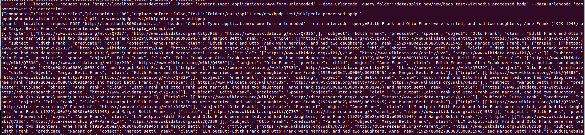

# No Need to Be a Know-It-All:Fact Checking Approach with Shallow Knowledge
This open-source project contains the Python implementation of our approach, ShallKnow. It is designed to improve fact-checking over knowledge graphs by augmenting them with shallow knowledge, automatically extracted RDF triples from unstructured sources. ShallKnow improves KG coverage, enabling more effective support or refutation of claims. 

## Installation

First, clone the repository:
<details><summary> </summary>
 
```bash
git clone https://github.com/factcheckerr/ShallKnow.git
cd ShallKnow
python3 -m venv venv
source venv/bin/activate
pip install -r requirements.txt
```
or 

```bash
git clone https://github.com/factcheckerr/ShallKnow.git
cd ShallKnow
python -m venv venv
venv\Scripts\activate
pip install -r requirements.txt
```
</details>

## Running experiments

To run this experiment, it is essential that Ollama is installed on your system. If it is not already installed, you can find more information and download it from the official website [here](https://ollama.com/download)

Then, pull and run the required model:
<details><summary> </summary>

```bash
ollama pull deepseek-r1:14b
ollama run deepseek-r1:14b
```
</details>

Once the model is running, execute the main script:

```bash
python scripts/wikipedia_extractor_final.py deepseek-r1:14b
```

After that, the output files from this experiment will serve as the input for the triple extraction process. Update the input folder name accordingly and proceed to run the next experiment.
Also, change the endpoint of the api [here](https://github.com/factcheckerr/ShallKnow/blob/main/scripts/extract_triples.py) if hosted on different port. `endpoint = "http://localhost:5000/extract"`


```bash
python scripts/extract_triples.py
```

<i>The following is an example of triple extraction:<i>





## Additional Resources

### Datasets

More informations about included datasets [here](https://zenodo.org/records/15390036)

### Supporting Tools


To compute fact-checking scores and evaluate our approach in ShallKnow, we use the following tools:

- [KnowledgeStream](https://github.com/saschaTrippel/knowledgestream): Used to compute plausibility scores for RDF triples based on path-based reasoning over the knowledge graph.
- [FAVEL](https://github.com/dice-group/favel): Used for fact-checking evaluation.
- [GERBIL](https://gerbil-kbc.aksw.org/gerbil/config): Used for standardized benchmarking.


